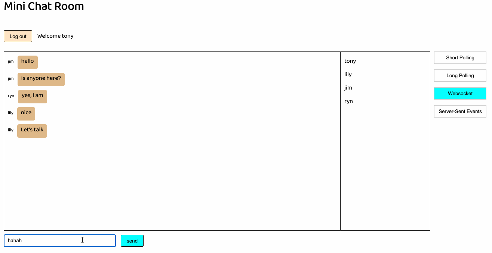
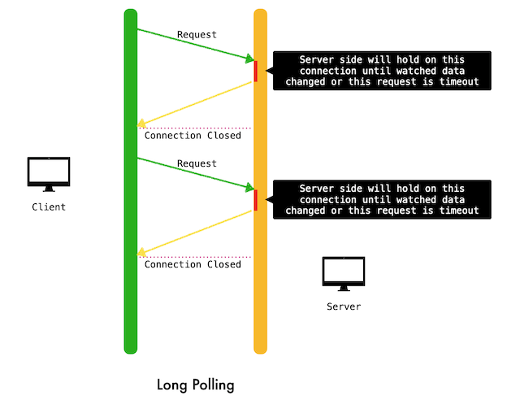
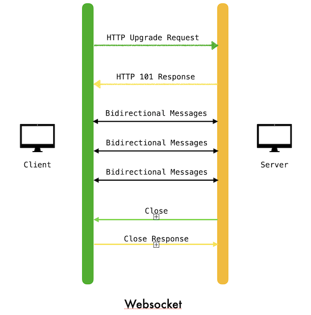
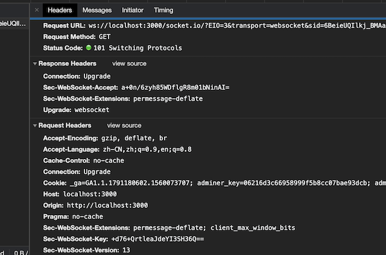
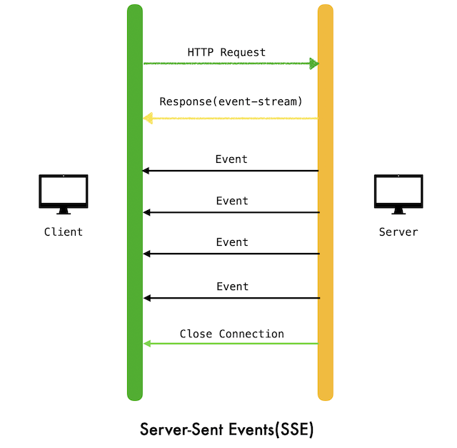

所谓的“实时推送”，从表面意思上来看是，客户端订阅的内容在发生改变时，服务器能够实时地通知客户端，进而客户端进行相应地反应。客户端不需要主观地发送请求去获取自己关心的内容，而是由服务器端进行“推送”。

注意上面的推送二字打了引号，这就意味着在现有的几种实现方式中，并不是服务器端主动地推送，而是通过一定的手段营造了一种实时的假象。就目前现有的几种技术而言，主要有以下几类：

- 客户端轮询：传统意义上的轮询(Short Polling)
- 客户端 + 服务器端轮询：长轮询(Long Polling/COMET)
- 全双工通信：Websocket
- 单向服务器推送：Server-Sent Events(SSE)

文中会以一个简易聊天室的例子来分别通过上述的四种方式实现，代码地址[mini-chatroom](https://github.com/Rynxiao/mini-chatroom)(存在些许bug，主要是为了做演示用)



## 轮询（Short Polling）

轮询的实现原理：客户端向服务器端发送一个请求，服务器返回数据，然后客户端根据服务器端返回的数据进行处理；然后客户端继续向服务器端发送请求，继续重复以上的步骤，如果不想给服务器端太大的压力，一般情况下会设置一个请求的时间间隔。


使用轮询明显的优点是基础不需要额外的开发成本，请求数据，解析数据，作出响应，仅此而已，然后不断重复。缺点也显而易见：

- 不断的发送和关闭请求，对服务器的压力会比较大，因为本身开启Http连接就是一件比较耗资源的事情
- 轮询的时间间隔不好控制。如果要求的实时性比较高，显然使用短轮询会有明显的短板，如果设置interval的间隔过长，会导致消息延迟，而如果太短，会对服务器产生压力

### 代码实现

```javascript
var ShortPollingNotification = {
  datasInterval: null,
  subscribe: function() {
    this.datasInterval = setInterval(function() {
      Request.getDatas().then(function(res) {
        window.ChatroomDOM.renderData(res);
      });
    }, TIMEOUT);
    return this.unsubscribe;
  },
  unsubscribe: function() {
    this.datasInterval && clearInterval(this.datasInterval);
  }
}
```


下面是对应的请求，注意左下角的请求数量一直在变化


在上图中，每隔1s就会发送一个请求，看起来效果还不错，但是如果将timeout的值设置成5s，效果将大打折扣，如图：


## 长轮询(Long Polling)

长轮询的基本原理：客户端发送一个请求，服务器会hold住这个请求，直到监听的内容有改变，才会返回数据，断开连接，客户端继续发送请求，重复以上步骤。或者在一定的时间内，请求还得不到返回，就会因为超时自动断开连接。



长轮询是基于轮询上的改进版本，主要是减少了客户端发起Http连接的开销，改成了在服务器端主动地去判断所关心的内容是否变化，所以其实轮询的本质并没有多大变化，变化的点在于：

- 对于内容变化的轮询由客户端改成了服务器端（客户端会在连接中断之后，会再次发送请求，对比短轮询来说，大大减少了发起连接的次数）
- 客户端只会在数据改变时去作相应的改变，对比短轮询来说，并不是全盘接收

### 代码实现

```javascript
// 客户端
var LongPollingNotification = {
    // ....
    subscribe: function() {
      var that = this;

      // 设置超时时间
      Request.getV2Datas(this.getKey(),{ timeout: 10000 }).then(function(res) {
        var data = res.data;
        window.ChatroomDOM.renderData(res);
        // 成功获取数据后会再次发送请求
        that.subscribe();
      }).catch(function (error) {
        // timeout 之后也会再次发送请求
        that.subscribe();
      });
      return this.unsubscribe;
    }

    // ....
}
```

笔者采用的是express，默认不支持hold住请求，因此用了一个express-longpoll的库来实现。

下面是一个原生不用库的实现（这里只是介绍原理），整体的思路是：如果服务器端支持hold住请求的话，那么在一定的时间内会自轮询，然后期间通过比较key值，判断是否返回新数据

- 客户端第一次会带一个空的key值，这次会立即返回，获取新内容，服务器端将计算出的contentKey返回给客户端
- 然后客户端发送第二次请求，带上第一次返回的contentKey作为key值，然后进行下一轮的比较
- 如果两次的key值相同，就会hold请求，进行内部轮询，如果期间有新内容或者客户端timeout，就会断开连接
- 重复以上步骤

```javascript
// 服务器端

router.get('/v2/datas', function(req, res) {
  const key = _.get(req.query, 'key', '');
  let contentKey = chatRoom.getContentKey();

  while (key === contentKey) {
    sleep.sleep(5);
    contentKey = chatRoom.getContentKey();
  }

  const connectors = chatRoom.getConnectors();
  const messages = chatRoom.getMessages();
  res.json({
    code: 200,
    data: { connectors: connectors, messages: messages, key: contentKey },
  });
});
```

以下是用 [express-longpoll](https://www.npmjs.com/package/express-longpoll) 的实现片段

```javascript
// mini-chatroom/public/javascripts/server/longPolling.js

function pushDataToClient(key, longpoll) {
  var contentKey = chatRoom.getContentKey();

  if (key !== contentKey) {
    var connectors = chatRoom.getConnectors();
    var messages = chatRoom.getMessages();

    longpoll.publish(
      '/v2/datas',
      {
        code: 200,
        data: {connectors: connectors, messages: messages, key: contentKey},
      }
    );
  }
}

longpoll.create("/v2/datas", function(req, res, next) {
  key = _.get(req.query, 'key', '');
  pushDataToClient(key, longpoll);
  next();
});

intervalId = setInterval(function() {
  pushDataToClient(key, longpoll);
}, LONG_POLLING_TIMEOUT);
```

为了方便演示，我将客户端发起请求的timeout改成了4s，注意观察下面的截图：


可以看到，断开连接的两种方式，要么是超时，要么是请求有数据返回。

### 基于iframe的长轮询模式

这种模式的具体的原理为：

- 在页面中嵌入一个iframe，地址指向轮询的服务器地址，然后在父页面中放置一个执行函数，比如`execute(data)`
- 当服务器有内容改变时，会向iframe发送一个脚本`<script>parent.execute(JSON.stringify(data))</script>`
- 通过发送的脚本，主动执行父页面中的方法，达到推送的效果

具体可以参看[这里](https://juejin.im/post/6844903955240058893#heading-4)

## Websocket

>The WebSocket Protocol enables two-way communication between a client running untrusted code in a controlled environment to a remote host that has opted-in to communications from that code.
>
>The protocol consists of an opening handshake followed by basic message framing, layered over TCP.
>
>The goal of this technology is to provide a mechanism for browser-based applications that need two-way communication with servers that does not rely on opening multiple HTTP connections (e.g., using XMLHttpRequest or iframe and long polling).
>
>
>The WebSocket Protocol attempts to address the goals of existing bidirectional HTTP technologies in the context of the existing HTTP infrastructure; as such, it is designed to work over HTTP ports 80 and 443 as well as to support HTTP proxies and intermediaries, even if this implies some complexity specific to the current environment.
>

### 特征

- websocket是双向通信的，设计的目的主要是为了减少传统轮询时http连接数量的开销
- 建立在TCP协议之上，握手阶段采用 HTTP 协议，因此握手时不容易屏蔽，能通过各种 HTTP 代理服务器
- 与HTTP兼容性良好，同样可以使用80和443端口
- 没有同源限制，客户端可以与任意服务器通信
- 可以发送文本，也可以发送二进制数据。
- 协议标识符是`ws`（如果加密，则为`wss`），服务器网址就是 URL



关于Websocket API方面的知识，这里不再作讲解，可以自己查阅[Websocket API MDN](https://developer.mozilla.org/en-US/docs/Web/API/WebSocket)

### 兼容性

websocket兼容性良好，基本支持所有现代浏览器

[](https://caniuse.com/mdn-api_websocket)

### 代码实现

笔者这里采用的是[socket.io](https://socket.io/)，是基于websocket的封装，提供了客户端以及服务器端的支持

```javascript
// 客户端
var WebsocketNotification = {
  // ...
  subscribe: function(args) {
    var connector = args[1];
    this.socket = io();

    this.socket.emit('register', connector);

    this.socket.on('register done', function() {
      window.ChatroomDOM.renderAfterRegister();
    });

    this.socket.on('data', function(res) {
      window.ChatroomDOM.renderData(res);
    });

    this.socket.on('disconnect', function() {
      window.ChatroomDOM.renderAfterLogout();
    });
  }
  // ...
}

// 服务器端
var io = socketIo(httpServer);

io.on('connection', (socket) => {
  socket.on('register', function(connector) {
    chatRoom.onConnect(connector);

    io.emit('register done');

    var data = chatRoom.getDatas();
    io.emit('data', { data });
  });

  socket.on('chat', function(message) {
    chatRoom.receive(message);

    var data = chatRoom.getDatas();
    io.emit('data', { data });
  });
});
```

响应格式如下：



## Server-Sent Events(SSE)

传统意义上服务器端不会主动推送给客户端消息，一般都是客户端主动去请求服务器端获取最新的数据。[SSE](https://developer.mozilla.org/en-US/docs/Web/API/Server-sent_events)就是一种可以主动从服务端推送消息的技术。

> SSE的本质其实就是一个HTTP的长连接，只不过它给客户端发送的不是一次性的数据包，而是一个stream流，格式为text/event-stream，所以客户端不会关闭连接，会一直等着服务器发过来的新的数据流，视频播放就是这样的例子。
>
> - SSE 使用 HTTP 协议，现有的服务器软件都支持。WebSocket 是一个独立协议。
> - SSE 属于轻量级，使用简单；WebSocket 协议相对复杂。
> - SSE 默认支持断线重连，WebSocket 需要自己实现。
> - SSE 一般只用来传送文本，二进制数据需要编码后传送，WebSocket 默认支持传送二进制数据。
> - SSE 支持自定义发送的消息类型。

基本的使用方法，参看[SSE API](https://developer.mozilla.org/en-US/docs/Web/API/Server-sent_events/Using_server-sent_events)



### 兼容性

目前除了IE以及低版本的浏览器不支持，基本支持绝大多数的现代浏览器。

[](https://caniuse.com/?search=Server-Sent%20Events)

### 代码实现

```javascript
// 客户端
var SSENotification = {
  source: null,
  subscribe: function() {
    if ('EventSource' in window) {
      this.source = new EventSource('/sse');

      this.source.addEventListener('message', function(res) {
        const d = res.data;
        window.ChatroomDOM.renderData(JSON.parse(d));
      });
    }
    return this.unsubscribe;
  },
  unsubscribe: function () {
    this.source && this.source.close();
  }
}

// 服务器端
router.get('/sse', function(req, res) {
  const connectors = chatRoom.getConnectors();
  const messages = chatRoom.getMessages();
  const response = { code: 200, data: { connectors: connectors, messages: messages } };

  res.writeHead(200, {
    "Content-Type":"text/event-stream",
    "Cache-Control":"no-cache",
    "Connection":"keep-alive",
    "Access-Control-Allow-Origin": '*',
  });

  res.write("retry: 10000\n");
  res.write("data: " + JSON.stringify(response) + "\n\n");

  var unsubscribe = Event.subscribe(function() {
    const connectors = chatRoom.getConnectors();
    const messages = chatRoom.getMessages();
    const response = { code: 200, data: { connectors: connectors, messages: messages } };
    res.write("data: " + JSON.stringify(response) + "\n\n");
  });

  req.connection.addListener("close", function () {
    unsubscribe();
  }, false);
});
```

下面是控制台的情况，注意观察响应类型


详情中注意查看请求类型，以及EventStream消息类型


## 总结

- 短轮询、长轮询实现成本相对比较简单，适用于一些实时性要求不高的消息推送，在实时性要求高德场景下，会存在延迟以及会给服务器带来更大的压力
- websocket目前而言实现成本相对较低，适合于双工通信，对于多人在线，要求实时性较高的项目比较实用
- SSE只能是服务器端推送消息，因此对于不需要双向通信的项目比较适用

## 参考连接

- [The WebSocket Protocol](https://tools.ietf.org/html/rfc6455)
- [Websocket API MDN](https://developer.mozilla.org/en-US/docs/Web/API/WebSocket)
- [Server-sent events MDN](https://developer.mozilla.org/en-US/docs/Web/API/Server-sent_events)
- [WebSocket 教程](http://www.ruanyifeng.com/blog/2017/05/websocket.html)
- [Server-Sent Events 教程](https://www.ruanyifeng.com/blog/2017/05/server-sent_events.html)
- [webSocket(二) 短轮询、长轮询、Websocket、sse](https://juejin.im/post/6844903955240058893)


