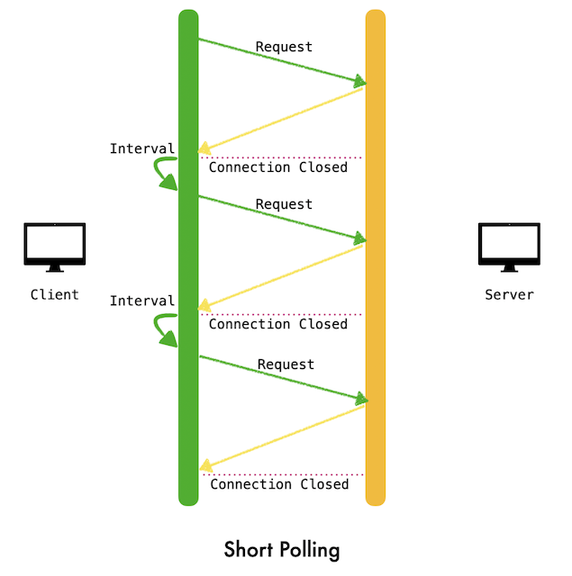
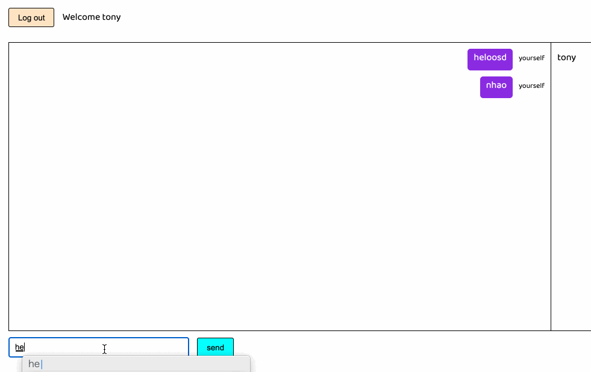
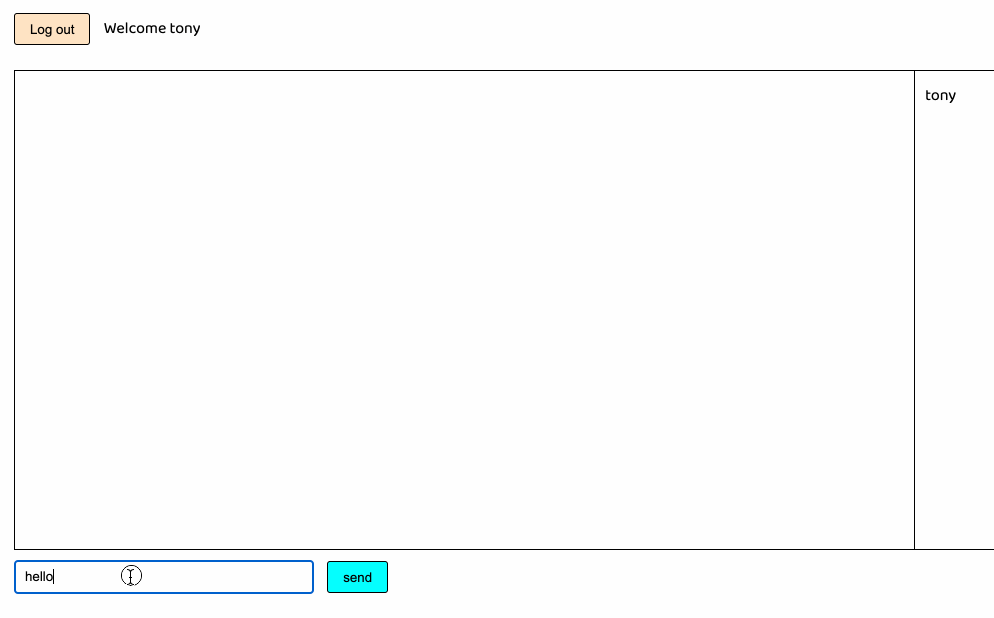

所谓的“实时推送”，从表面意思上来看是，客户端订阅的内容在发生改变时，服务器能够实时地通知客户端，进而客户端进行相应地反应。客户端不需要主观地发送请求去获取自己关心的内容，而是由服务器端进行“推送”。

注意上面的推送二字打了引号，这就意味着在现有的几种实现方式中，并不是服务器端主动地推送，而是通过一定的手段营造了一种实时的假象。就目前现有的几种技术而言，主要有以下几类：

- 客户端轮询：传统意义上的轮询(Short Polling)
- 客户端 + 服务器端轮询：长轮询(Long Polling/COMET)
- 全双工通信：Websocket
- 单向服务器推送：Server-Sent Events(SSE)

从上面可以看出，真正是由服务器端进行主动消息推送的也就是Websocket以及SSE，至于轮询和长轮询就是营造出的假象。

文中会以一个简易聊天室的例子来分别通过上述的四种方式实现，代码地址[mini-chatroom](https://github.com/Rynxiao/mini-chatroom)


## 轮询（Short Polling）

轮询的实现原理：客户端向服务器端发送一个请求，服务器返回数据，然后客户端根据服务器端返回的数据进行处理；然后客户端继续向服务器端发送请求，继续重复以上的步骤，如果不想给服务器端太大的压力，一般情况下会设置一个请求的时间间隔。



使用轮询明显的优点是基础不需要额外的开发成本，请求数据，解析数据，作出响应，仅此而已，然后不断重复。缺点也显而易见：

- 不断的发送和关闭请求，对服务器的压力会比较大，因为本身开启Http连接就是一件比较耗资源的事情
- 轮询的时间间隔不好控制。如果要求的实时性比较高，显然使用短轮询会有明显的短板，如果设置interval的间隔过长，会导致消息延迟，而如果太短，会对服务器产生压力

代码实现：
```javascript
var ShortPollingNotification = {
  datasInterval: null,
  subscribe: function() {
    this.datasInterval = setInterval(function() {
      Request.getDatas().then(function(res) {
        window.ChatroomDOM.renderData(res);
      });
    }, TIMEOUT);
    return this.unsubscribe;
  },
  unsubscribe: function() {
    this.datasInterval && clearInterval(this.datasInterval);
  }
}
```



下面是对应的请求，注意左下角的请求数量一直在变化


在上图中，每隔1s就会发送一个请求，看起来效果还不错，但是如果将timeout的值设置成5s，效果将大打折扣，如图：



## 长轮询(Long Polling)

长轮询的基本原理：客户端发送一个请求，服务器会hold住这个请求，直到监听的内容有改变，才会返回数据，断开连接，客户端继续发送请求，重复以上步骤。或者在一定的时间内，请求还得不到返回，就会因为超时自动断开连接。


长轮询是基于轮询上的改进版本，主要是减少了客户端发起Http连接的开销，改成了在服务器端主动地去判断所关心的内容是否变化，所以其实轮询的本质并没有多大变化，变化的点在于：

- 对于内容变化的轮询由客户端改成了服务器端（客户端会在连接中断之后，会再次发送请求，对比短轮询来说，大大减少了发起连接的次数）
- 客户端只会在数据改变时去作相应的改变，对比短轮询来说，并不是全盘接收

代码实现：
```javascript
// 客户端
var LongPollingNotification = {
    // ....
    subscribe: function() {
      var that = this;

      // 设置超时时间
      Request.getV2Datas(this.getKey(),{ timeout: 10000 }).then(function(res) {
        var data = res.data;
        window.ChatroomDOM.renderData(res);
        // 成功获取数据后会再次发送请求
        that.subscribe();
      }).catch(function (error) {
        // timeout 之后也会再次发送请求
        that.subscribe();
      });
      return this.unsubscribe;
    }

    // ....
}
```

笔者采用的是express，默认不支持hold住请求，因此用了一个express-longpoll的库来实现。

下面是一个原生不用库的实现（这里只是介绍原理），整体的思路是：如果服务器端支持hold住请求的话，那么在一定的时间内会自轮询，然后期间通过比较key值，判断是否返回新数据

- 客户端第一次会带一个空的key值，这次会立即返回，获取新内容，服务器端将计算出的contentKey返回给客户端
- 然后客户端发送第二次请求，带上第一次返回的contentKey作为key值，然后进行下一轮的比较
- 如果两次的key值相同，就会hold请求，进行内部轮询，如果期间有新内容或者客户端timeout，就会断开连接
- 重复以上步骤

```javascript
// 服务器端

router.get('/v2/datas', function(req, res) {
  const key = _.get(req.query, 'key', '');
  let contentKey = chatRoom.getContentKey();

  while (key === contentKey) {
    sleep.sleep(5);
    contentKey = chatRoom.getContentKey();
  }

  const connectors = chatRoom.getConnectors();
  const messages = chatRoom.getMessages();
  res.json({
    code: 200,
    data: { connectors: connectors, messages: messages, key: contentKey },
  });
});
```

以下是用 [express-longpoll](https://www.npmjs.com/package/express-longpoll) 的实现片段

```javascript
// mini-chatroom/public/javascripts/server/longPolling.js

function pushDataToClient(key, longpoll) {
  var contentKey = chatRoom.getContentKey();

  if (key !== contentKey) {
    var connectors = chatRoom.getConnectors();
    var messages = chatRoom.getMessages();

    longpoll.publish(
      '/v2/datas',
      {
        code: 200,
        data: {connectors: connectors, messages: messages, key: contentKey},
      }
    );
  }
}

longpoll.create("/v2/datas", function(req, res, next) {
  key = _.get(req.query, 'key', '');
  pushDataToClient(key, longpoll);
  next();
});

intervalId = setInterval(function() {
  pushDataToClient(key, longpoll);
}, LONG_POLLING_TIMEOUT);
```

为了方便演示，我将客户端发起请求的timeout改成了4s，注意观察下面的截图：


可以看到，断开连接的两种方式，要么是超时，要么是请求有数据返回。


